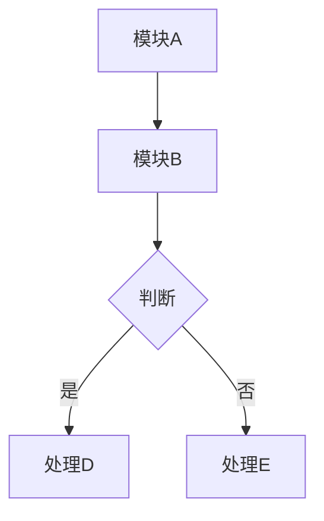

# 专利挖掘与技术交底书生成（Claude Desktop macOS 版）

> 本 skill 从原版 [patent-disclosure-skill](https://github.com/handsomestWei/patent-disclosure-skill)
> 移植改编，适配 Claude Desktop macOS 环境——无需 Claude Code，无需本地 Python/Node 预装，
> 所有步骤均在 Claude Desktop 对话中完成，工具按需调用并自动降级。

---

## 环境与工具能力

本 skill 依赖以下工具，按优先级自动选择：

| 能力 | 优先方式 | 降级方式 |
|------|---------|---------|
| 读取本地文件（.md/.txt/.py 等） | Desktop Commander `read_file` | 请用户粘贴内容 |
| 读取 Word 文档（.docx） | Desktop Commander `read_file`（提取文本）| 请用户复制粘贴关键段落 |
| 读取 PPT（.pptx）| Desktop Commander bash `python3 pptx_to_md.py`（需已安装） | 请用户提供文字稿 |
| 联网查新 | 内置 `web_search`（epub.cnipa.gov.cn + Google Patents）| 已是最终降级 |
| 写入本地文件 | Desktop Commander `write_file` | 在对话中输出全文供复制 |
| 生成 .docx | Word MCP（若已连接）| Desktop Commander bash `python3 md_to_docx.py`（需已安装）| 仅输出 Markdown |
| Mermaid 图渲染 | Desktop Commander bash `npx mmdc`（需 Node.js）| 输出 fenced mermaid 代码块，用户自行渲染 |

**调用原则**：每步执行前先静默检查工具可用性，不可用则自动降级，不中断流程、不反复询问。

---

## 触发条件

以下任一条件满足时启用本 skill：

- 用户提及：专利挖掘、专利点、技术交底书、交底书、专利交底书、查新、现有技术对比、专利申请
- 简短指令：`/patent`、`/交底书`、`/专利`
- **迭代模式（按意图识别，不要求固定词）**：用户明显在已有交底书基础上继续工作
  （如：改章节、补实施例、补图、修正参数、调整表述等）→ 直接进入「迭代模式」，
  **禁止**重新跑 Step 2–4 专利点全文分析，除非用户明确要求重新挖掘。

---

## 输出命名约定

- 每次交付均以 `{案件名}_{YYYYMMDDHHmmss}` 命名，**含首次定稿与每次迭代**
- 同时交付 `.md`（主文件）与 `.docx`（如工具可用）
- 默认输出路径：`~/Desktop/patent-disclosures/{案件标识}/`（可由用户指定）
- **禁止覆盖旧稿**，除非用户明确要求

---

## 主流程（8 步）

### Step 1：信息收集（intake）

向用户确认以下信息（已知的跳过，一次性列出，不逐条追问）：

1. **技术主题**：一句话描述核心技术
2. **项目材料**：本地文档路径（设计文档、代码、PPT 等）或直接粘贴
3. **发明人 / 权利人**（后续写入交底书，可先占位「待填」）
4. **案件名称**（用于文件命名，如无则用技术主题关键词自动生成）
5. **输出路径**（未指定则默认 `~/Desktop/patent-disclosures/{案件标识}/`）
6. **脱敏要求**：是否需要隐去公司名、产品名、人名等
7. **已有交底书**（迭代时必问）：路径或粘贴内容

> 若用户已在第一句话中提供了足够信息，跳过或精简本步。

---

### Step 2：项目文档扫描（project_scan）

**目标**：全面理解项目技术栈，为专利点挖掘奠基。

**扫描优先级**（按顺序，找到足够内容即可）：
1. 设计文档、需求文档、技术方案（.md / .txt / .docx）
2. 核心代码（架构文件、主要模块、算法实现）
3. PPT / 演示材料

**文件读取方式**：

```
# 文本文件：直接读取
Desktop Commander read_file {路径}

# Word 文档：读取文本层（Desktop Commander 支持 .docx 文本提取）
Desktop Commander read_file {路径}.docx

# PPT（需已安装 python-pptx）：
Desktop Commander bash: python3 ~/patent-disclosure-skill/tools/pptx_to_md.py \
  --input {路径}.pptx --output /tmp/scan_temp.md
Desktop Commander read_file /tmp/scan_temp.md

# 降级：请用户粘贴关键章节到对话中
```

**扫描产出**（内部，不向用户输出全文）：
- 技术架构摘要（系统组成、模块关系、数据流）
- 核心算法 / 流程要点
- 技术难点与解决思路
- 可能的创新点初步列表

---

### Step 3–4：专利点挖掘与确认（patent_points_analyzer）

**Step 3：候选专利点提炼**

从扫描结果中提炼候选专利点，每个专利点按以下结构输出：

```
【专利点 N】{标题}
- 技术问题：现有方案存在什么不足？
- 解决方案：本发明如何解决（概括到发明原理层，不暴露实现细节）？
- 技术效果：可量化或可比较的优势（速度/准确率/资源占用等）
- 独立性评估：与其他候选点是否可合并？
```

**Step 4：融合确认**

- 展示候选专利点列表，征询用户意见
- 可合并相似点、拆分过于宽泛的点
- 用户确认后，输出**最终专利点列表**（通常 1–3 个主要专利点）
- **等待用户明确确认后再进入 Step 5**

---

### Step 5：联网查新（prior_art_search）

**查新目标**：确认专利点的新颖性，找出最接近的现有技术，支撑区别技术特征论述。

#### 查新策略（按优先级）

**优先：国家知识产权局·中国专利公布公告站**

```
web_search: site:epub.cnipa.gov.cn {技术关键词1} {技术关键词2}
web_search: epub.cnipa.gov.cn {核心技术方案关键词}
```

若 `epub.cnipa.gov.cn` 检索无结果或结果不相关，降级为：

```
web_search: 专利 {技术关键词} {问题描述关键词} site:patents.google.com
web_search: 中国专利 {技术关键词} 公开 申请
web_search: {技术关键词} prior art patent
```

**查新规范**：
- 每个专利点至少检索 2 轮，用不同关键词组合
- 对每条检索结果：读取摘要（不仅看标题），判断技术方案是否相关
- **禁止**仅凭标题判断相关性，必须理解摘要后再得出结论
- 检索到相关专利时，记录：公开号、申请日、申请人、技术要点、与本发明的区别

**查新结果写入交底书第 1.1 节**，格式：

```markdown
### 1.1 现有技术

检索来源：中国专利公布公告（epub.cnipa.gov.cn）、Google Patents

| 公开号 | 标题 | 申请日 | 与本发明区别 |
|--------|------|--------|------------|
| CN... | ... | 20XX-XX-XX | 本发明采用...，区别在于... |

**区别技术特征分析**：
现有技术 [公开号] 虽然涉及...，但未公开/解决...。
本发明通过...实现了...，具有...的技术效果。
```

---

### Step 6：交底书预览（disclosure_preview）

在完整撰写之前，向用户展示交底书大纲及核心内容摘要：

```
案件名称：{案件名}
核心专利点：{N 个专利点标题}
技术方案概述：（2–3 句）
拟撰写章节：1.背景技术 / 2.发明内容 / 3.技术方案 / 4.实施例 / 5.附图
查新结论：新颖性（初步）/ 区别特征要点
```

**用户确认大纲后**进入 Step 7。若用户希望跳过预览，直接进入 Step 7。

---

### Step 7：交底书定稿（disclosure_builder）

按以下模板全文撰写，严格遵守脱敏要求。

#### 文档结构

```markdown
# 技术交底书

**案件名称**：{案件名}  
**技术领域**：{领域}  
**发明人**：{姓名}（待填）  
**日期**：{YYYY-MM-DD}  

---

## 1. 背景技术

### 1.1 现有技术

{查新结果，含专利列表与区别特征分析}

### 1.2 现有技术的不足

{具体的、可量化的不足，与专利点的技术问题对应}

---

## 2. 发明内容

### 2.1 发明目的

本发明旨在解决{技术问题}，提供一种{解决方案概述}。

### 2.2 技术方案概述

{独立权利要求雏形：方法/装置/系统，采用功能性语言，不暴露实现细节}

### 2.3 技术效果

{可量化或可对比的效果，与 1.2 的不足一一对应}

---

## 3. 技术方案

### 3.1 总体架构

{文字说明，各模块及其关系}

### 3.2 系统框图

{mermaid 图，见下方规范}

### 3.3 核心流程说明

{各关键步骤的技术细节，脱敏处理}

### 3.4 关键流程图

{mermaid 图，见下方规范}

### 3.5 关键技术点详述

{逐一对应专利点，每点：问题→方案→效果→与现有技术的区别}

---

## 4. 实施例

### 4.1 实施例一：{场景名}

{完整的端到端示例，含输入、处理过程、输出，数据可脱敏替换}

### 4.2 实施例二（可选）

{另一应用场景}

---

## 5. 附图说明

图 1：系统框图（对应第 3.2 节）  
图 2：关键流程图（对应第 3.4 节）  
{如有更多图示则列出}

---

## 6. 权利要求雏形（供代理人参考）

### 独立权利要求

1. 一种{技术主题}的方法/装置，其特征在于，包括：
   （1）{步骤/模块 1}；
   （2）{步骤/模块 2}；
   （3）{步骤/模块 3}。

### 从属权利要求（可选）

2. 根据权利要求 1 所述的{方法/装置}，其特征在于，{进一步限定}。

---

## 附录：术语表（如需脱敏映射）

| 原始术语 | 交底书用词 |
|---------|----------|
| {系统内部名} | {通用技术名} |
```

#### Mermaid 图规范

系统框图（3.2）和关键流程图（3.4）均用 fenced mermaid 代码块：

~~~markdown

~~~

**图示渲染**（如 Desktop Commander + Node.js 可用）：

```bash
# 安装（首次）
cd ~/patent-disclosure-skill/tools && npm install

# 渲染（自动提取 mermaid 块并生成 PNG）
python3 ~/patent-disclosure-skill/tools/mermaid_render.py \
  {交底书路径}.md --output-dir {输出目录}
```

若 Node.js 不可用：输出 fenced mermaid 代码块，用户可在 [mermaid.live](https://mermaid.live) 或 Obsidian 中自行渲染，并在 Word 中插入 PNG。

#### .docx 生成（按优先级）

**方式 1：Word MCP（若已在 Claude Desktop 中连接）**
```
Word MCP: create_document / insert_text（逐节插入）
```

**方式 2：Desktop Commander + md_to_docx.py（需已安装）**
```bash
python3 ~/patent-disclosure-skill/tools/md_to_docx.py \
  --input {案件名}_{时间戳}.md \
  --output {案件名}_{时间戳}.docx
```

**方式 3（降级）**：仅输出 `.md` 文件，提示用户用 Pandoc / Typora / Word 自行转换：
```bash
# 用户自行运行
pandoc {案件名}_{时间戳}.md -o {案件名}_{时间戳}.docx
```

#### 文件落盘

```bash
# 写入 .md（Desktop Commander）
Desktop Commander write_file \
  ~/Desktop/patent-disclosures/{案件标识}/{案件名}_{YYYYMMDDHHmmss}.md \
  {完整 Markdown 内容}
```

---

### Step 8：内部自检（disclosure_self_check）

**自检在后台执行，不写入交底书正文，不向用户展示清单。**

逐一检查：

```
□ 技术效果与背景不足一一对应，无悬空项
□ 权利要求雏形与技术方案一致，无超范围表述
□ 实施例数据已脱敏，无内部系统名/人名/公司名残留
□ 现有技术区别特征明确，有检索依据（非凭空编造）
□ Mermaid 语法无明显错误（graph/flowchart 节点引用一致）
□ 章节内引用（如「见图1」）与附图说明对应
□ 全文技术术语一致（同一概念不混用多种表述）
□ 文件名符合 {案件名}_{YYYYMMDDHHmmss} 格式
```

发现问题 → 静默修正后重新生成，最终输出修订后版本。

---

## 迭代模式

### 触发

根据用户**意图**判断，无需固定词。下列情况均触发迭代：

- 「第3章再详细一点」「补一个实施例」「图2改一下」→ **合并模式**
- 「权利要求写的不对」「把这个参数改成X」「现有技术描述有误」→ **纠正模式**
- 对话中已出现交底书路径 / 上文刚刚交付草稿 → 优先迭代，**不重新挖掘专利点**

### 合并模式（新材料/扩展）

1. 读取已有交底书文件（Desktop Commander `read_file` 或用户粘贴）
2. 理解新增内容 / 扩展意图
3. 将新内容融入对应章节，保持原有结构
4. 对修改部分在内部执行 Step 8 自检
5. **另存为新文件**（新时间戳），**不覆盖旧稿**
6. 在案件目录追加修订记录：

```markdown
## 修订记录 {YYYYMMDDHHmmss}

**修订类型**：合并/扩展  
**修改章节**：{章节号}  
**主要变更**：{简述}  
**新文件**：{案件名}_{时间戳}.md  
```

### 纠正模式（错误/与事实不符）

1. 读取已有交底书
2. 定位错误所在章节
3. 纠正，保持其余部分不变
4. 内部自检
5. **另存为新文件**（新时间戳）
6. 在案件目录追加修订记录（同上，类型标「纠正」）

---

## Agent 执行检查清单（内部，不向用户展示）

```
□ Step 1 已收集必要信息（未完整则补充询问）
□ Step 2 已扫描项目文档，或已请用户提供内容
□ Step 3-4 候选专利点已与用户确认
□ Step 5 查新已执行：epub.cnipa.gov.cn 优先，
         无结果则 Google Patents 补充；摘要已阅读，非仅凭标题
□ Step 6 大纲已预览（或用户明确跳过）
□ Step 7 交底书已按模板全文撰写，脱敏规则已遵守；
         Mermaid 图已输出（可渲染或代码块）；
         .md 已写入本地（Desktop Commander）；
         .docx 已尝试生成（按优先级降级）
□ Step 8 自检已在后台完成，正文无「自检清单」章节
□ 文件名符合 {案件名}_{YYYYMMDDHHmmss} 格式
□ 迭代时：未重新跑专利点分析；
          已另存为新时间戳文件；
          修订记录已追加
```

---

## 安装与配置

### 方式一：Claude Desktop Project（推荐）

1. 在 Claude Desktop 中新建一个 **Project**（如「专利工作台」）
2. 将本文件（`SKILL.md`）上传为 **Project Knowledge**
3. 在该 Project 内的所有对话中，本 skill 自动生效

### 方式二：自定义指令

将本文件内容粘贴到 Claude Desktop **Settings → Custom Instructions**（适合全局使用）。

### 可选：增强工具配置

如需本地文件读写和 Shell 执行能力，在 `claude_desktop_config.json` 中启用 Desktop Commander：

```json
{
  "mcpServers": {
    "desktop-commander": {
      "command": "npx",
      "args": ["-y", "@wonderwhy-er/desktop-commander"]
    }
  }
}
```

如需 Word 文档直接生成，在配置中启用 Word MCP（需已安装 Claude in Excel / Word beta）。

### 可选：原版 Python 工具（docx/pptx 转换 + Mermaid 渲染）

若需要更完整的 Office 格式支持和 Mermaid 图渲染，可选装原版工具：

```bash
# 克隆工具脚本
git clone https://github.com/handsomestWei/patent-disclosure-skill.git \
  ~/patent-disclosure-skill

# 基础依赖（Office 转换）
pip install -r ~/patent-disclosure-skill/requirements.txt

# Mermaid 渲染（需 Node.js）
cd ~/patent-disclosure-skill/tools && npm install
```

安装后，Desktop Commander 的 bash 执行能力可调用这些脚本，获得与 Claude Code 版本接近的体验。

---

## 与原版的关键差异

| 能力 | 原版（Claude Code）| 本版（Claude Desktop）|
|------|------------------|----------------------|
| Skill 加载 | 自动发现 `.claude/skills/` | Project Knowledge 或自定义指令 |
| 文件读写 | `Read`/`Write` 工具 | Desktop Commander / 对话输出 |
| Shell 执行 | 内置 `Bash` | Desktop Commander（可选）|
| 国知局查新 | `cnipa_epub_search.py`（Playwright）| `web_search` 直接检索 |
| Office 转换 | 内置脚本自动执行 | Desktop Commander + 脚本（可选）|
| Mermaid 渲染 | 自动 PNG 嵌入 | 代码块 + 可选 npx mmdc |
| .docx 生成 | 自动（mermaid_render.py）| Word MCP > 脚本 > 仅 Markdown |
| 迭代日志 | `iteration_dialog_log.py` | 手工追加 / Desktop Commander |

**核心流程逻辑完全一致**，差异仅在工具调用层。
