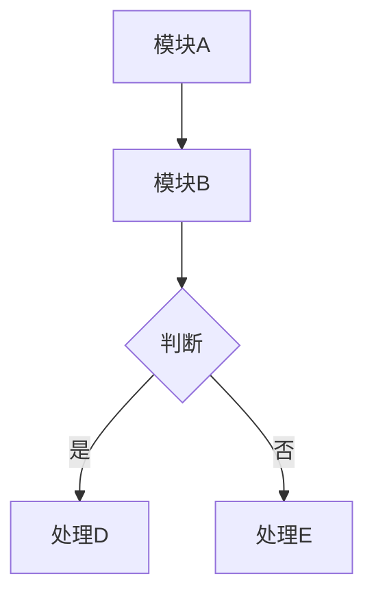

# 专利工作台 Skill：挖掘 · 交底 · 答复辅助

> 本 skill 从原版 [patent-disclosure-skill](https://github.com/handsomestWei/patent-disclosure-skill)
> 移植改编并扩展，适配 Claude Desktop、Codex 以及其他可读取文件、联网检索、写入文档的 Agent 环境。
> 主流程不依赖 Claude Code，也不强制要求本地 Python/Node 预装；增强功能按可用工具自动降级。

> **专利实务边界**：本 skill 用于梳理技术材料、生成交底书草稿、辅助起草审查意见答复文本与权利要求修改思路；不构成法律意见、专利代理意见或授权/驳回结果预测。所有拟提交给国知局的文件，必须由申请人、专利代理师或具备相应资格的专业人士结合原申请文件、通知书、对比文件和当前法律法规复核后再提交。本 skill 不替用户提交任何官方文件，也不承诺提高授权率或避免驳回。

---

## 工作模式总览

本 skill 含三个并列工作模式，按用户意图与所持材料自动分流：

| 模式 | 入口信号 | 用户手里的材料 | 走哪条流程 |
|------|---------|--------------|-----------|
| **A. 交底书生成** | 「挖专利点」「写交底书」「查新」 | 项目文档/代码/PPT | 主流程 8 步 |
| **B. 交底书迭代** | 「改第3章」「补实施例」「权利要求不对」 | 已有交底书草稿 | 迭代模式 |
| **C. 审查意见答复辅助** | 「审查意见」「一通」「OA」「补正」「对比文件」「驳回」 | 通知书 + 对比文件 + 原申请文件 | 审查意见答复辅助草拟模式 |

**分流原则**：手里是「项目材料」→ A；手里是「已有交底书 + 修改意图」→ B；手里是「官方通知书 + 对比文件」→ C。
模式 A 与 C 共用后文「创造性论证方法论」一节（四层退守法 + 结合启示）。模式 C 只负责辅助分析和草拟，不替代专利代理师的正式判断。

---

## 环境与工具能力

本 skill 依赖以下工具，按优先级自动选择：

| 能力 | 优先方式 | 降级方式 |
|------|---------|---------|
| 读取本地文件（.md/.txt/.py 等） | Agent 文件读取工具（如 Codex / Claude Desktop + Desktop Commander） | 请用户粘贴内容 |
| 读取 Word 文档（.docx） | 文档读取工具 / Desktop Commander / Codex 本地文件能力 | 请用户复制粘贴关键段落 |
| 读取 PPT（.pptx）| 本地脚本或文档解析工具（如 `python3 pptx_to_md.py`，需已安装） | 请用户提供文字稿 |
| 联网查新 | Agent 内置联网检索（epub.cnipa.gov.cn + Google Patents）| 已是最终降级 |
| 写入本地文件 | Agent 文件写入工具（如 Codex / Desktop Commander） | 在对话中输出全文供复制 |
| 生成 .docx | Word MCP / 文档工具 | 本地脚本 `python3 md_to_docx.py`（需已安装）| 仅输出 Markdown |
| Mermaid 图渲染 | 本地 `npx mmdc` 或等效渲染工具（需 Node.js）| 输出 fenced mermaid 代码块，用户自行渲染 |

**调用原则**：每步执行前先静默检查工具可用性，不可用则自动降级，不中断流程、不反复询问。

---

## 正式依据与引用边界

本 skill 的专利实务判断只引用公开法律法规和审查规则作为边界，不把网络经验当作法律结论：

| 依据 | 在本 skill 中的用途 |
|------|------------------|
| 《中华人民共和国专利法》第二十二条 | 新颖性、创造性、实用性的基本判断框架；创造性表述对应“突出的实质性特点和显著的进步”。 |
| 《中华人民共和国专利法》第二十六条 | 说明书公开充分、权利要求清楚且以说明书为依据的基本边界。 |
| 《中华人民共和国专利法》第三十三条 | 申请文件修改不得超出原说明书和权利要求书记载范围，是 OA 阶段修改建议的硬约束。 |
| 《专利审查指南》 | 用于细化创造性判断、实质审查程序、审查意见答复、修改文本核查等操作性规则；具体条文以现行最新版为准。 |

民间文章、代理经验和审查员经验只可作为“组织答复思路”的启发，不能替代上述正式依据。生成答复草稿时，凡涉及法条或审查规则，均应提示用户按当前有效文本复核。

---

## 触发条件

以下任一条件满足时启用本 skill：

- **模式 A（交底书生成）**：专利挖掘、专利点、技术交底书、交底书、专利交底书、查新、现有技术对比、专利申请；简短指令 `/patent`、`/交底书`、`/专利`
- **模式 B（迭代，按意图识别，不要求固定词）**：用户明显在已有交底书基础上继续工作
  （如：改章节、补实施例、补图、修正参数、调整表述等）→ 直接进入「迭代模式」，
  **禁止**重新跑 Step 2–4 专利点全文分析，除非用户明确要求重新挖掘。
- **模式 C（审查意见答复辅助，按意图识别）**：审查意见通知书、一通、二通、OA、意见陈述书、补正、补正通知书、对比文件、创造性/新颖性答辩、驳回、答复审查员；简短指令 `/oa`、`/审查意见`、`/答复`
  → 直接进入「审查意见答复辅助草拟模式」，**不走** Step 1–8 交底书流程。

---

## 输出命名约定

- 每次交付均以 `{案件名}_{YYYYMMDDHHmmss}` 命名，**含首次定稿与每次迭代**
- 同时交付 `.md`（主文件）与 `.docx`（如工具可用）
- 默认输出路径：`~/Desktop/patent-disclosures/{案件标识}/`（可由用户指定）
- **禁止覆盖旧稿**，除非用户明确要求

---

## 主流程（8 步）

### Step 1：信息收集（intake）

向用户确认以下信息（已知的跳过，一次性列出，不逐条追问）：

1. **技术主题**：一句话描述核心技术
2. **项目材料**：本地文档路径（设计文档、代码、PPT 等）或直接粘贴
3. **发明人 / 权利人**（后续写入交底书，可先占位「待填」）
4. **案件名称**（用于文件命名，如无则用技术主题关键词自动生成）
5. **输出路径**（未指定则默认 `~/Desktop/patent-disclosures/{案件标识}/`）
6. **脱敏要求**：是否需要隐去公司名、产品名、人名等
7. **已有交底书**（迭代时必问）：路径或粘贴内容

> 若用户已在第一句话中提供了足够信息，跳过或精简本步。

---

### Step 2：项目文档扫描（project_scan）

**目标**：全面理解项目技术栈，为专利点挖掘奠基。

**扫描优先级**（按顺序，找到足够内容即可）：
1. 设计文档、需求文档、技术方案（.md / .txt / .docx）
2. 核心代码（架构文件、主要模块、算法实现）
3. PPT / 演示材料

**文件读取方式**：

```
# 文本文件：直接读取
Agent 文件读取工具 {路径}

# Word 文档：读取文本层
Agent 文档读取工具 {路径}.docx

# PPT（需已安装 python-pptx）：
Agent shell/terminal 工具: python3 ~/patent-disclosure-skill/tools/pptx_to_md.py \
  --input {路径}.pptx --output /tmp/scan_temp.md
Agent 文件读取工具 /tmp/scan_temp.md

# 降级：请用户粘贴关键章节到对话中
```

**扫描产出**（内部，不向用户输出全文）：
- 技术架构摘要（系统组成、模块关系、数据流）
- 核心算法 / 流程要点
- 技术难点与解决思路
- 可能的创新点初步列表

---

### Step 3–4：专利点挖掘与确认（patent_points_analyzer）

**Step 3：候选专利点提炼**

从扫描结果中提炼候选专利点，每个专利点按以下结构输出：

```
【专利点 N】{标题}
- 技术问题：现有方案存在什么不足？
- 解决方案：本发明如何解决（概括到发明原理层，不暴露实现细节）？
- 技术效果：可量化或可比较的优势（速度/准确率/资源占用等）
- 独立性评估：与其他候选点是否可合并？
- 创造性储备：除核心方案外，列出 2–3 个本可写进权利要求、但暂不放进独权的次级技术细节
  （如特定参数范围、替代结构、优化步骤）——留作日后答复审查意见时修改权利要求的"弹药"
```

> **创造性储备说明**：答复审查意见时，一种常见策略是从原说明书中选择已经记载、尚未写入权利要求、且有助于区分现有技术的特征，作为权利要求修改和创造性论证的候选依据（详见后文「审查意见答复辅助草拟模式 · 修改策略」）。
> 这要求交底书在源头就保留足够技术细节，因此挖掘阶段即标注，并在实施例（第 4 节）中充分展开。交底书是给申请人/代理人使用的技术材料，不宜写得过薄；对外公开和权利要求布局则需由代理人结合保护范围、公开充分和商业保密要求另行把握。

**Step 4：融合确认**

- 展示候选专利点列表，征询用户意见
- 可合并相似点、拆分过于宽泛的点
- 用户确认后，输出**最终专利点列表**（通常 1–3 个主要专利点）
- **等待用户明确确认后再进入 Step 5**

---

### Step 5：联网查新（prior_art_search）

**查新目标**：确认专利点的新颖性，找出最接近的现有技术，支撑区别技术特征论述。

#### 查新策略（按优先级）

**优先：国家知识产权局·中国专利公布公告站**

```
web_search: site:epub.cnipa.gov.cn {技术关键词1} {技术关键词2}
web_search: epub.cnipa.gov.cn {核心技术方案关键词}
```

若 `epub.cnipa.gov.cn` 检索无结果或结果不相关，降级为：

```
web_search: 专利 {技术关键词} {问题描述关键词} site:patents.google.com
web_search: 中国专利 {技术关键词} 公开 申请
web_search: {技术关键词} prior art patent
```

**查新规范**：
- 每个专利点至少检索 2 轮，用不同关键词组合
- 对每条检索结果：读取摘要（不仅看标题），判断技术方案是否相关
- **禁止**仅凭标题判断相关性，必须理解摘要后再得出结论
- 检索到相关专利时，记录：公开号、申请日、申请人、技术要点、与本发明的区别

**查新结果写入交底书第 1.1 节**，格式：

```markdown
### 1.1 现有技术

检索来源：中国专利公布公告（epub.cnipa.gov.cn）、Google Patents

| 公开号 | 标题 | 申请日 | 与本发明区别 |
|--------|------|--------|------------|
| CN... | ... | 20XX-XX-XX | 本发明采用...，区别在于... |

**区别技术特征分析**（按后文「创造性论证方法论」的四层退守法逐层展开）：
现有技术 [公开号] 虽然涉及……，但：
（1）技术领域：是否同领域？若不同，不能作为最接近现有技术；
（2）技术特征：未公开本发明的特征 X（指明具体差异，而非笼统"未涉及"）；
（3）技术问题：其解决的问题与本发明不同（本发明针对……）；
（4）技术效果：本发明达到的……效果是该现有技术无法实现的。

> 不要只写一句"未公开/未解决"——单层论证经不起审查员推敲，四层逐层退守才稳；
> 若命中多篇对比文件，补充「结合启示」论述（见方法论第二节）。
```

---

### Step 6：交底书预览（disclosure_preview）

在完整撰写之前，向用户展示交底书大纲及核心内容摘要：

```
案件名称：{案件名}
核心专利点：{N 个专利点标题}
技术方案概述：（2–3 句）
拟撰写章节：1.背景技术 / 2.发明内容 / 3.技术方案 / 4.实施例 / 5.附图
查新结论：新颖性（初步）/ 区别特征要点
```

**用户确认大纲后**进入 Step 7。若用户希望跳过预览，直接进入 Step 7。

---

### Step 7：交底书定稿（disclosure_builder）

按以下模板全文撰写，严格遵守脱敏要求。

#### 文档结构

```markdown
# 技术交底书

**案件名称**：{案件名}  
**技术领域**：{领域}  
**发明人**：{姓名}（待填）  
**日期**：{YYYY-MM-DD}  

---

## 1. 背景技术

### 1.1 现有技术

{查新结果，含专利列表与区别特征分析}

### 1.2 现有技术的不足

{具体的、可量化的不足，与专利点的技术问题对应}

---

## 2. 发明内容

### 2.1 发明目的

本发明旨在解决{技术问题}，提供一种{解决方案概述}。

### 2.2 技术方案概述

{独立权利要求雏形：方法/装置/系统，采用功能性语言，不暴露实现细节}

### 2.3 技术效果

{可量化或可对比的效果，与 1.2 的不足一一对应}

---

## 3. 技术方案

### 3.1 总体架构

{文字说明，各模块及其关系}

### 3.2 系统框图

{mermaid 图，见下方规范}

### 3.3 核心流程说明

{各关键步骤的技术细节，脱敏处理}

### 3.4 关键流程图

{mermaid 图，见下方规范}

### 3.5 关键技术点详述

{逐一对应专利点，每点按四层展开：技术问题 → 解决方案 → 技术效果 → 与最接近现有技术的区别（四层论证法）；
若查新命中多篇对比文件，补充「结合启示」论述：说明各对比文件之间为何缺乏结合动机（详见「创造性论证方法论」）}

---

## 4. 实施例

### 4.1 实施例一：{场景名}

{完整的端到端示例，含输入、处理过程、输出，数据可脱敏替换}

### 4.2 实施例二（可选）

{另一应用场景}

### 4.3 备用技术细节（创造性储备）

{对应 Step 3「创造性储备」，逐条记录可日后补入权利要求的次级特征：
参数取值/范围、替代实现、附加优化步骤等。
此节为答复审查意见预留修改空间，可不进入独立权利要求，但需在说明书层面写清楚，确保日后修改不超出原说明书和权利要求书记载的范围（《中华人民共和国专利法》第三十三条）。}

---

## 5. 附图说明

图 1：系统框图（对应第 3.2 节）  
图 2：关键流程图（对应第 3.4 节）  
{如有更多图示则列出}

---

## 6. 权利要求雏形（供代理人参考）

### 独立权利要求

1. 一种{技术主题}的方法/装置，其特征在于，包括：
   （1）{步骤/模块 1}；
   （2）{步骤/模块 2}；
   （3）{步骤/模块 3}。

### 从属权利要求（可选）

2. 根据权利要求 1 所述的{方法/装置}，其特征在于，{进一步限定}。

---

## 附录：术语表（如需脱敏映射）

| 原始术语 | 交底书用词 |
|---------|----------|
| {系统内部名} | {通用技术名} |
```

#### Mermaid 图规范

系统框图（3.2）和关键流程图（3.4）均用 fenced mermaid 代码块：

~~~markdown

~~~

**图示渲染**（如本地 shell/terminal + Node.js 可用）：

```bash
# 安装（首次）
cd ~/patent-disclosure-skill/tools && npm install

# 渲染（自动提取 mermaid 块并生成 PNG）
python3 ~/patent-disclosure-skill/tools/mermaid_render.py \
  {交底书路径}.md --output-dir {输出目录}
```

若 Node.js 不可用：输出 fenced mermaid 代码块，用户可在 [mermaid.live](https://mermaid.live) 或 Obsidian 中自行渲染，并在 Word 中插入 PNG。

#### .docx 生成（按优先级）

**方式 1：Word MCP 或等效文档工具（若已连接）**
```
Word MCP: create_document / insert_text（逐节插入）
```

**方式 2：本地 shell/terminal + md_to_docx.py（需已安装）**
```bash
python3 ~/patent-disclosure-skill/tools/md_to_docx.py \
  --input {案件名}_{时间戳}.md \
  --output {案件名}_{时间戳}.docx
```

**方式 3（降级）**：仅输出 `.md` 文件，提示用户用 Pandoc / Typora / Word 自行转换：
```bash
# 用户自行运行
pandoc {案件名}_{时间戳}.md -o {案件名}_{时间戳}.docx
```

#### 文件落盘

```bash
# 写入 .md（Agent 文件写入工具）
Agent write_file \
  ~/Desktop/patent-disclosures/{案件标识}/{案件名}_{YYYYMMDDHHmmss}.md \
  {完整 Markdown 内容}
```

---

### Step 8：内部自检（disclosure_self_check）

**自检在后台执行，不写入交底书正文，不向用户展示清单。**

逐一检查：

```
□ 技术效果与背景不足一一对应，无悬空项
□ 权利要求雏形与技术方案一致，无超范围表述
□ 实施例数据已脱敏，无内部系统名/人名/公司名残留
□ 现有技术区别特征明确，有检索依据（非凭空编造）
□ Mermaid 语法无明显错误（graph/flowchart 节点引用一致）
□ 章节内引用（如「见图1」）与附图说明对应
□ 全文技术术语一致（同一概念不混用多种表述）
□ 文件名符合 {案件名}_{YYYYMMDDHHmmss} 格式
```

发现问题 → 静默修正后重新生成，最终输出修订后版本。

---

## 迭代模式

### 触发

根据用户**意图**判断，无需固定词。下列情况均触发迭代：

- 「第3章再详细一点」「补一个实施例」「图2改一下」→ **合并模式**
- 「权利要求写的不对」「把这个参数改成X」「现有技术描述有误」→ **纠正模式**
- 对话中已出现交底书路径 / 上文刚刚交付草稿 → 优先迭代，**不重新挖掘专利点**

### 合并模式（新材料/扩展）

1. 读取已有交底书文件（Desktop Commander `read_file` 或用户粘贴）
2. 理解新增内容 / 扩展意图
3. 将新内容融入对应章节，保持原有结构
4. 对修改部分在内部执行 Step 8 自检
5. **另存为新文件**（新时间戳），**不覆盖旧稿**
6. 在案件目录追加修订记录：

```markdown
## 修订记录 {YYYYMMDDHHmmss}

**修订类型**：合并/扩展  
**修改章节**：{章节号}  
**主要变更**：{简述}  
**新文件**：{案件名}_{时间戳}.md  
```

### 纠正模式（错误/与事实不符）

1. 读取已有交底书
2. 定位错误所在章节
3. 纠正，保持其余部分不变
4. 内部自检
5. **另存为新文件**（新时间戳）
6. 在案件目录追加修订记录（同上，类型标「纠正」）

---

## 创造性论证方法论（模式 A / C 共用）

本节是交底书区别分析（Step 5、3.5）与审查意见答复（模式 C）的共同内核，只在此处定义一次，前后各处引用。

### 一、判断"是否相当于"的四层退守法

收到"现有技术 X 相当于本发明 Y"的论断时，按顺序逐层判断；任一层存在差异，均可作为争辩或修改权利要求时的分析依据，越靠后的差异通常越接近技术贡献本身：

a. **技术领域**：对比文件与本申请是否同一技术领域？不同 → 可争辩其不适合作为最接近现有技术，或不宜直接与其他对比文件结合。
b. **技术特征**：对比文件公开的特征是否完整覆盖了本申请权利要求的特征？不是 → 从具体特征差异展开（指明差异，不要笼统）。
c. **技术问题**：把相关特征放回对比文件整体方案，看它要解决的问题与本申请是否相同？不同 → 展开论述。
d. **技术效果**：该特征在对比文件中的效果与在本申请中的效果是否相同？不同 → 展开。

> 若四层均高度接近，单纯争辩空间会明显变小，此时应优先考虑是否需要基于原说明书修改权利要求，而不是硬辩。

### 二、结合启示 / 发明构思（应对"对比文件 1 + 2 结合"）

审查员用两篇对比文件组合评述创造性时，争辩重点不在单篇，而在**两篇之间是否存在结合动机**：

- 从发明构思还原：申请人发现现有技术 A 存在问题 B → 针对 B 采用特征 C 解决。
- 若对比文件 1 本身不存在问题 B，可进一步论证本领域技术人员看到对比文件 1 时缺少寻找并结合对比文件 2 的动机，从而削弱“对比文件 1 + 2”组合评述的合理性。

> 交底书阶段就应在背景技术里点明"现有技术不存在本发明所要解决的问题"，为日后这一论证铺垫。

### 三、应对三类常见套路

| 审查员套路 | 反制要点 |
|-----------|---------|
| "隐含公开了你这个" | 隐含公开须能从对比文件"直接、毫无疑义地确定"。若能举出现有技术反例，可用于削弱该隐含公开判断（如：不能因"电脑"就当然认定隐含公开"键盘"——存在无键盘的平板电脑）。 |
| "属于公知常识/惯用手段" | 若该特征恰是发明点，论述其带来意料不到的技术效果，并可要求审查员举证。 |
| "对比文件 1+2 结合" | 见上"结合启示"——论证缺乏结合动机。 |

---

## 审查意见答复辅助草拟模式（模式 C）

> 入口：用户手里是国知局《通知书》（补正通知书 / 审查意见通知书）+ 对比文件 + 原申请文件。
> **不走** Step 1–8 交底书流程。
> 本模式只输出分析框架、答复草稿和修改建议，不替代正式专利代理服务。若通知书、对比文件或原申请文件缺失，先列出缺失材料和问题清单，不直接生成可提交版本。

### C0：材料收集

一次性向用户索取（已提供的跳过）：

1. 通知书类型与文号（补正通知书 / 第 N 次审查意见通知书）、**答复期限**
2. 通知书全文（路径或粘贴）
3. 审查员引用的对比文件（公开号或全文）
4. 本案原始权利要求书 + 说明书（路径或粘贴）
5. 答复倾向：纯争辩 / 争辩 + 修改权利要求

> 期限一律按北京时间（UTC+8）计算并提醒；期限、延期可能性和提交方式需以通知书和官方系统为准。
> **本 skill 仅产出答复文本供用户本人或代理人审核递交，禁止替用户向国知局提交任何文件。**

### C1：区分通知书类型

- **补正通知书（初审 / 形式缺陷）**：通常涉及文件完整性、签章、著录项、费用或形式规范等问题，一般不展开新颖性/创造性论证。
  → 逐条列出需补正项与标准补正方式，提示用户在期限内补交。**不需要创造性论证**。
- **审查意见通知书（实审 / 实质缺陷）**：新颖性、创造性、不清楚、单一性、公开不充分等。
  → 进入 C2 实质答复。

### C2：实质答复——1 套 1 秘 3 原则

**3 原则**

1. **首尾客气**：开头感谢审查、说明已仔细阅读；结尾可请求在修改或陈述基础上继续审查，必要时请求给予再次陈述/修改机会（模板化，简短即可；避免承诺授权结果）。
2. **面对错误有底气**：先通读通知书、**亲自读对比文件全文**（不只读审查员摘出的那句），用四层法核查每个"相当于"。发现牵强处明确指出，有理有据、语气坚定但不生硬。
3. **答复有条理有层次**：每个区别特征按四层论证（特征 → 问题 → 效果 → 退一步仍不相当 → 非公知常识）逐层展开；逐项权利要求论述创造性。

**1 秘（常见修改策略，非结果保证）**

审查意见答复通常有两类路径：一是基于原权利要求进行陈述争辩；二是在不超出原申请文件记载范围的前提下修改权利要求，并说明修改依据与修改后仍具备新颖性/创造性的理由。若仅作文字润色、错别字修正或未针对审查意见作实质回应，通常难以改变审查基础；但修改是否足以克服缺陷、是否会引发新的审查意见，必须由专利代理师结合通知书和对比文件判断，不能机械套用。

→ **操作**：从原说明书/实施例中挑出已明确记载、能够区分对比文件、且有技术效果支撑的"储备特征"（正是交底书第 4.3 节预留的），作为是否补入权利要求的候选项；若决定补入，应逐条标明原文依据，并对该特征的新颖性/创造性单独论述。

> 提醒用户：①修改不得超出原说明书和权利要求书记载的范围（《中华人民共和国专利法》第三十三条）；②若说明书可挖的储备特征不多，后续修改空间会明显受限；③独权特征越多保护范围通常越窄，是否修改以及如何修改需在授权可能性与保护范围之间权衡。

**1 套（答复书结构）**

1. 客气开头（原则 1）
2. **修改说明**：本次对权利要求作了哪些修改、修改内容记载于原说明书或原权利要求何处（用于核查未超范围，符合《中华人民共和国专利法》第三十三条）。未修改则省略本部分。
3. **指出审查员理解有误之处**（原则 2 + 四层法 + 结合启示）。
4. **逐项论述权利要求的新颖性/创造性**：先定区别特征，按四层展开论证"突出的实质性特点"，再补一段本权能实现而现有技术实现不了的效果以证明"显著的进步"。独权论证充分后，从权可声明"因独权具创造性故从权同样具备"（有精力则逐条论述更稳）。
5. 客气结尾（原则 1）

### C3：答复书产出与自检

- 产出《意见陈述书》草稿文本（.md，工具可用时附 .docx）；如建议修改权利要求，附**修改后的权利要求书草稿**，单独成段并清楚标注修改处与原文依据。
- 命名 `{案件名}_答复_{YYYYMMDDHHmmss}`，**不覆盖旧稿**。
- 内部自检（不向用户展示清单）：

```
□ 已亲自核对对比文件全文，非仅依赖审查员转述
□ 每个"相当于"已用四层法逐一核查
□ 权利要求修改未超出原说明书和权利要求书记载范围（专利法第三十三条）
□ 补入的储备特征已单独论述创造性
□ 逐项权利要求均有创造性结论
□ 首尾客气段齐备
□ 全文未替用户做任何对外提交动作
```

---

## Agent 执行检查清单（内部，不向用户展示）

```
□ Step 1 已收集必要信息（未完整则补充询问）
□ Step 2 已扫描项目文档，或已请用户提供内容
□ Step 3-4 候选专利点已与用户确认
□ Step 5 查新已执行：epub.cnipa.gov.cn 优先，
         无结果则 Google Patents 补充；摘要已阅读，非仅凭标题
□ Step 6 大纲已预览（或用户明确跳过）
□ Step 7 交底书已按模板全文撰写，脱敏规则已遵守；
         Mermaid 图已输出（可渲染或代码块）；
         .md 已写入本地（Desktop Commander）；
         .docx 已尝试生成（按优先级降级）
□ Step 8 自检已在后台完成，正文无「自检清单」章节
□ 文件名符合 {案件名}_{YYYYMMDDHHmmss} 格式
□ 迭代时：未重新跑专利点分析；
          已另存为新时间戳文件；
          修订记录已追加
□ 审查意见答复（模式 C）时：已区分补正/实质通知书；
          已亲自读对比文件全文；每个"相当于"经四层法核查；
          权利要求修改未超原说明书和权利要求书记载范围；补入特征已单独论述创造性；
          全程未替用户向国知局提交文件
```

---

## 安装与配置

### 方式一：Claude Desktop Project（推荐）

1. 在支持项目知识库的 Agent 中新建一个项目（如「专利工作台」）
2. 将本文件（`SKILL.md`）上传为项目知识或自定义 skill
3. 在该项目内的所有对话中，本 skill 自动生效

### 方式二：自定义指令 / Codex skill

将本文件内容粘贴到对应 Agent 的自定义指令，或放入 Codex / Claude 等工具约定的 skill 目录中。

### 可选：增强工具配置

如在 Claude Desktop 中使用，且需要本地文件读写和 Shell 执行能力，可在 `claude_desktop_config.json` 中启用 Desktop Commander：

```json
{
  "mcpServers": {
    "desktop-commander": {
      "command": "npx",
      "args": ["-y", "@wonderwhy-er/desktop-commander"]
    }
  }
}
```

如需 Word 文档直接生成，可配置 Word MCP 或其他文档生成工具。

### 可选：原版 Python 工具（docx/pptx 转换 + Mermaid 渲染）

若需要更完整的 Office 格式支持和 Mermaid 图渲染，可选装原版工具：

```bash
# 克隆工具脚本
git clone https://github.com/handsomestWei/patent-disclosure-skill.git \
  ~/patent-disclosure-skill

# 基础依赖（Office 转换）
pip install -r ~/patent-disclosure-skill/requirements.txt

# Mermaid 渲染（需 Node.js）
cd ~/patent-disclosure-skill/tools && npm install
```

安装后，具备本地 shell/terminal 能力的 Agent 可调用这些脚本，获得与 Claude Code 版本接近的体验。

---

## 与原版的关键差异

### 功能覆盖

| | 原版 patent-disclosure-skill | 本版（v2.0.0）|
|---|---|---|
| 模式 A：专利挖掘 + 交底书生成 | ✅ | ✅ |
| 模式 B：交底书迭代 | ✅ | ✅ |
| 模式 C：补正与审查意见答复辅助草拟（OA） | —— | ✅ **新增** |

### 工具调用层（移植适配）

| 能力 | 原版（Claude Code）| 本版（跨 Agent 适配）|
|------|------------------|----------------------|
| Skill 加载 | 自动发现 `.claude/skills/` | Project Knowledge / 自定义指令 / Codex skill |
| 文件读写 | `Read`/`Write` 工具 | Codex 文件工具 / Desktop Commander / 对话输出 |
| Shell 执行 | 内置 `Bash` | Codex terminal / Desktop Commander / 其他本地 shell 工具 |
| 国知局查新 | `cnipa_epub_search.py`（Playwright）| `web_search` 直接检索 |
| Office 转换 | 内置脚本自动执行 | 本地 shell 工具 + 脚本（可选）|
| Mermaid 渲染 | 自动 PNG 嵌入 | 代码块 + 可选 npx mmdc |
| .docx 生成 | 自动（mermaid_render.py）| Word MCP > 脚本 > 仅 Markdown |
| 迭代日志 | `iteration_dialog_log.py` | 手工追加 / Desktop Commander |

**模式 A/B（交底书生成与迭代）的流程逻辑与原版一致，差异仅在工具调用层；模式 C（补正与审查意见答复辅助草拟）为本版 v2.0.0 新增的工作模式，属流程层扩展。**
